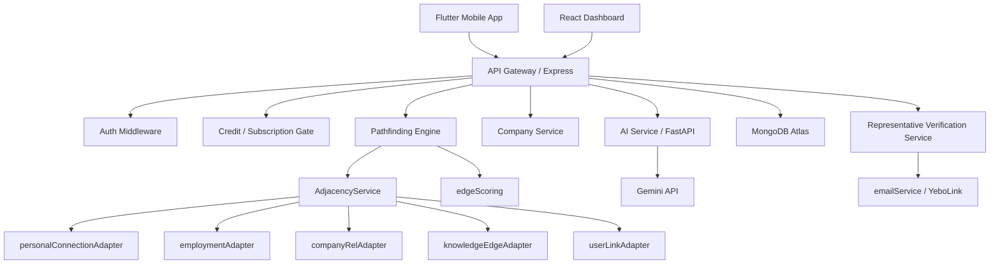

# System Architecture

## High-Level Overview



## API Service (`pathorah-api`)

Express 4 / TypeScript monolith. Organized by feature:

```
src/
  models/         — Mongoose schemas (Company, Branch, Employment, CompanyRelationship, KnowledgeEdge, ...)
  services/
    pathfinding/
      core/       — GraphNode types, BFS engine, AdjacencyService
      adapters/   — One adapter per edge kind
      scoring/    — edgeScoring (unified), pathScoring
      resolvers/  — targetResolver, nodeHydrator
  controllers/    — Thin HTTP handlers
  routes/         — Express routers
  middleware/     — auth, companyAdmin, creditCheck, subscriptionLoad, rateLimit
  scripts/        — backfillCompanies, verifyPathfinding (regression tests)
```

## AI Service (`pathorah-ai`)

FastAPI / Python. Dedicated enrichment service — the API calls it, it calls Gemini, it returns suggestions. The API never calls Gemini directly.

```
app/
  api/v1/endpoints/
    companies.py   — POST /enrich/company
    paths.py       — path enrichment
    warmth.py      — warmth signal inference
    discover.py    — discovery suggestions
  services/
    gemini_client.py           — Gemini API wrapper
    entity_prompt_renderer.py  — per-node-type prompt templates
```

## Pathfinding Engine Architecture

The engine was refactored from two divergent monolithic files into a clean separation of concerns:

### Before (legacy)
- `pathfindingService.ts` (893 lines) — local BFS, person-only
- `smartPathfindingService.ts` (535 lines) — global BFS, different scoring
- `pathScoringService.ts` (114 lines) — scoring split across both
- Known issues: O(n) `Array.shift()`, O(n) path array spreads, two divergent scoring systems, `calculateWarmthDecay` defined but never called

### After (current)
- `core/GraphNode.ts` — polymorphic `{nodeType, nodeId}` types and edge kind definitions
- `core/bfs.ts` — heterogeneous BFS with parent-pointer reconstruction (eliminates O(n) spreads), per-depth visited cache, wall-clock timeout
- `core/AdjacencyService.ts` — fan-out coordinator; expands a node by calling all registered adapters
- `adapters/personalConnectionAdapter.ts` — Connection collection edges
- `adapters/employmentAdapter.ts` — Employment collection edges (emits REPRESENTS/REPRESENTED_BY for rep flags)
- `adapters/companyRelAdapter.ts` — CompanyRelationship collection edges
- `adapters/knowledgeEdgeAdapter.ts` — KnowledgeEdge collection edges
- `adapters/userLinkAdapter.ts` — cross-ref between User and Contact nodes sharing an identity
- `scoring/edgeScoring.ts` — single unified scorer replacing both legacy systems; `calculateWarmthDecay` finally wired in
- `scoring/pathScoring.ts` — aggregate path score from edge sequence
- `resolvers/targetResolver.ts` — resolves `targetType+targetId` to a `GraphNodeRef`
- `resolvers/nodeHydrator.ts` — enriches `GraphNodeRef` into displayable `GraphNode`

Adding a new entity type = one new adapter file, zero changes to BFS or scoring.

## Data Layer

MongoDB Atlas with Mongoose ODM. Notable indexes:

- `Company`: text index on `name + aliases + description`; 2dsphere on `headquarters.coords`; sparse unique on `slug`; sparse on `domain`
- `Employment`: partial unique on `(userId, companyId, startDate)` and `(contactId, companyId, startDate)`; `representativeEmailOtpHash` with `select: false`
- `CompanyRelationship`: unique on `(fromCompanyId, toCompanyId, type, startDate)` to prevent duplicate relationship rows
- `Branch`: 2dsphere on `location.coords`; unique `(companyId, slug)`

## Scoped Admin Permissions

`companyAdmin` middleware checks `Employment.isCompanyAdmin` per company rather than a global role. This means a user who is a company admin for Acme Corp cannot edit profiles for Globex Corp. Distinct from `isRepresentative` which is a graph semantics concept, not a permissions concept.